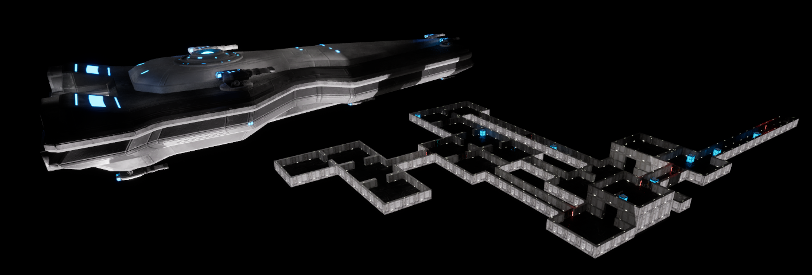

[Back to Portfolio](./)

### **Defense Documentation**

1.  [Statement of Purpose (with the Problem Statement)](#1-statement-of-purpose)

2.  [Research & Background](#2-research--background)

3.  [Project Language(s), Software, and Hardware](#3-project-languages-software-and-hardware)

4.  [Project Requirements](#4-project-requirements)

5.  [Project Implementation Description, and Explanation](#5-project-implementation-description-and-explanation)

6.  [Test Plan](#6-test-plan)

7.  [Test Results](#7-test-results)

8.  [Challenges Overcome](#8-challenges-overcome)

9.  [Future Enhancements](#9-future-enhancements)

10. [Defense Presentation Slides](#10-defense-presentation-slides)

<!-- -->

# **1. Statement of Purpose**

People should act more rationally and think more logically when
looking at problems that can be solved within reason, and this can
be taught through the unassuming medium of a video game. Nearly
every day, I see the consequences of people, who should know better,
making illogical and irrational decisions.

I want to make people see the world in a different light; to be more
open and reasonable, to think logically, and I also want to entertain.
Through this mode of thinking, the world would be a kinder place, full
of empathy, compassion, and understanding, and this is the ideal state
of affairs.

My solution to this problem is the development of a video game. My
intention with this solution is to mold the minds of those who
experience it to solve the problem discussed above, and to have fun
learning.

# **2. Research and Background**

A great deal of personal research has gone into the development of
this video game, as I have had no prior knowledge on game-making
until beginning its development last year, and one class in high
school. I have yet to learn the most intricate techniques more
seasoned developers have utilized in the engine I have been building
with, Unreal Engine 5, but the base knowledge on the program I have
gathered thus far is indispensable. I have watched hours of
tutorials and beginner's guides to learn how best to use this
program and to create even further beyond what I am developing now
for this project.

# **3. Project Language(s), Software, and Hardware**

The development engine I am using for my project is Unreal Engine 5
(UE5), the fifth installment of a video game development system by
Epic Games. It utilizes a block-coding methodology for the majority
of the work done within it, but behind the scenes - and also
directly manipulatable - it runs on C++. In addition to the standard
libraries, packages, and assets found within the base UE5 studio, I
have gathered many assets used in my project from the Fab database,
an often-used plugin for UE5, all of which are licensing free.
Lastly, I am using GitHub for version control, since UE5 has a
partnership program alongside GitHub, with a built-in plugin
available for download. As for hardware, most modern computing
systems can at least moderately handle the development studio
itself, as I am using my personal computer to develop the project,
but there is no particular hardware required to run the game other
than a mouse, keyboard, and visual monitor on a computer device.

# **4. Project Requirements**

**Requirement #: 1**

Requirement Type: Functional

Event/BUC/PUC #: Running game

Description: The player shall be able to move their avatar within the
game world.

Rationale: The player should be able to manipulate the location of the
character in order to play the game

Originator: Developer

Fit Criterion: Testable by determining if player avatar is capable of
movement upon game start

Priority: Primary

Dependencies: Functional game

Conflicts: None

Supporting Materials:

History: Development log

**Requirement #: 2**

Requirement Type: Functional

Event/BUC/PUC #: Running game

Description: The player shall be able to change their avatar\'s visual
perspective, or camera

Rationale: The player should be able to manipulate where their character
looks in order to interact with the game world

Originator: Developer

Fit Criterion: Testable by determining if player persepctive is capable
of maneuvering upon game start

Priority: Primary

Dependencies: Functional game

Conflicts: None

Supporting Materials:

History: Development log

**Requirement #: 3**

Requirement Type: Functional

Event/BUC/PUC #: Running game

Description: The player shall be able to interact with the virtual
environment presented by the game

Rationale: The player should be able to interact with their character\'s
surroudnings in order to progress through the game

Originator: Developer

Fit Criterion: Testable by determining if player is able to interact
with interactable objects in the game world upon game start

Priority: Primary

Dependencies: Functional game

Conflicts: None

Supporting Materials:

History: Development log

**Requirement #: 4**

Requirement Type: Functional

Event/BUC/PUC #: Running game

Description: The player shall be able to inspect and interact with their
character\'s inventory, or collected items, in the game world

Rationale: The player should be able to interact with their inventory in
order to select items to be used to progress through the game

Originator: Developer

Fit Criterion: Testable by determining if player is able to inspect and
interact with their character\'s inventory upon game start

Priority: Primary

Dependencies: Functional game

Conflicts: None

Supporting Materials:

History: Development log

**Requirement #: 5**

Requirement Type: Functional

Event/BUC/PUC #: Running game

Description: The player shall be able to pause the active game world to
stop it from running in real time

Rationale: The player should be able to pause the game in order to
adjust game settings, or to take a break when wanted

Originator: Developer

Fit Criterion: Testable by determining if player is able to pause the
game environment upon game start

Priority: Primary

Dependencies: Functional game

Conflicts: None

Supporting Materials:

History: Development log

**Requirement #: 6**

Requirement Type: Functional

Event/BUC/PUC #: None

Description: The player must use a machine capable of installing,
launching, and running the game to play or test the product

Rationale: In order to play the Puzzle Heart game, a user should first
have a machine that is able to run the program to play it.

Originator: Developer

Fit Criterion: Testable by determining if a user\'s machine is fit to
install and run the Puzzle Heart game

Priority: Foundational

Dependencies: Budget for a machine

Conflicts: Without a machine capable of running the game, then all
further use cases for the product would be impossible to achieve

Supporting Materials:

History: N/A

**Requirement #: 7**

Requirement Type: Functional

Event/BUC/PUC #: Having a machine capable of downloading the Puzzle
Heart game

Description: The player shall be able to download the files required to
play the game upon acquisition or playtesting session

Rationale: The player must first install the game before being able to
play it

Originator: Developer

Fit Criterion: Testable by determining if a user\'s copy of the game is
able to be launched upon successful download

Priority: Foundational

Dependencies: Having a machine

Conflicts: Without a machine capable of downloading the game, a user
cannot play the game on their machine, and there all further use cases
for the product would be impossible to achieve

Supporting Materials:

History: N/A

**Requirement #: 8**

Requirement Type: Functional

Event/BUC/PUC #: Having a downloaded copy of the Puzzle Heart game

Description: The player shall be able to launch the Puzzle Heart game
after downloading the files required to do so

Rationale: In order to run and play the game, it must first be
successfully launched by using the downloaded files necessary

Originator: Developer

Fit Criterion: Testable by determining if the game can be ran after
launching

Priority: Foundational

Dependencies: Having downloaded the game

Conflicts: If the game cannot be launched to begin play, then the game
cannot be played, and so all further use cases for the product would be
impossible to achieve

Supporting Materials:

History: N/A

**Requirement #: 9**

Requirement Type: Functional

Event/BUC/PUC #: Launching the game

Description: The player shall be able to start playing the game after a
successful launch of the product

Rationale: To play the Puzzle Heart game, a user must first start its
running sequence

Originator: Developer

Fit Criterion: Testable by determining if the game can be played after
starting

Priority: Foundational

Dependencies: Having launched the game

Conflicts: If the game cannot be started, then the game cannot be
played, and so all further use cases for the product would be impossible
to achieve

Supporting Materials:

History: N/A

**Requirement #: 10**

Requirement Type: Functional

Event/BUC/PUC #: Starting the game

Description: The player shall be able to stop and exit the game at any
point after starting it, or upon completing the game

Rationale: When a user wishes to exit the game, they should be freely
able to do so at any point they wish

Originator: Developer

Fit Criterion: Testable by determining if the game can be stopped and
exited after starting

Priority: Foundational

Dependencies: Having started the game

Conflicts: None

Supporting Materials:

History: N/A

**Requirement #: 11**

Requirement Type: Functional

Event/BUC/PUC #: Playing the game

Description: A test user shall be timed for the duration of their
playtime with Puzzle Heart

Rationale: An average time of completion is sought for testing purposes,
so all test user play instances should be recorded

Originator: Developer

Fit Criterion: Testable by utilizing a time-recording program or simple
stopwatch for a test user\'s playtime duration

Priority: Fundamental for testing

Dependencies: Playing the game

Conflicts: None

Supporting Materials:

History: Logged time to completion for each test user\'s test run

**Requirement #: 12**

Requirement Type: Functional

Event/BUC/PUC #: Completing the game

Description: A test user shall be surveyed on their experience of their
playtime with Puzzle Heart

Rationale: Feedback is required to improve the game, and so test user\'s
should be asked about their experience, and their responses recorded

Originator: Developer

Fit Criterion: Testable by utilizing a written or digital form sheet and
submission system to gather test user feedback

Priority: Fundamental for testing

Dependencies: Test user finishing a playtest session

Conflicts: None

Supporting Materials:

History: Feedback logged

**Requirement #: 13**

Requirement Type: Non-Functional

Event/BUC/PUC #: Settings menu established

Description: Players shall be able to adjust the volume level of in-game
sounds and music

Rationale: Players should be able to adjust the volume of the game to
best suit their desired level

Originator: Developer

Fit Criterion: Testable by determining that players can access the
option to adjust volume, and ensure that the adjustment works as
intended

Priority: Secondary

Dependencies: None

Conflicts: None

Supporting Materials:

History: Development logs

**Requirement #: 14**

Requirement Type: Non-Functional

Event/BUC/PUC #: Settings menu opened

Description: Players shall be able to adjust the brightness of the
game\'s visuals

Rationale: Players should be able to adjust the brightness of the game
to best suit their desired level

Originator: Developer

Fit Criterion: Testable by determining that players can access the
option to adjust brightness, and ensure that the adjustment works as
intended

Priority: Secondary

Dependencies: None

Conflicts: None

Supporting Materials:

History: Development Logs

**Requirement #: 15**

Requirement Type: Non-Functional

Event/BUC/PUC #: Game is running

Description: Players shall be able to experience the narrative of the
game through its visual effects on screen

Rationale: Players should be able to experience the story of Puzzle
Heart purely through the game\'s visuals without audio being necessary

Originator: Developer

Fit Criterion: Testable by determining if narrative is effectively
conveyed through the visual effects within the game

Priority: Primary

Dependencies: None

Conflicts: None

Supporting Materials:

History: Development Logs

**Requirement #: 16**

Requirement Type: Functional

Event/BUC/PUC #: Game loading

Description: The game world will be procedurally generated on startup,
making every experience different in some capacity

Rationale: The reason for this is to make every experience a unique one
when playing Puzzle Heart

Originator: Developer

Fit Criterion: Testable by determining if game world is different in
some way on every startup

Priority: Primary

Dependencies: Functional game

Conflicts: None

Supporting Materials:

History: Development Logs

**Requirement #: 17**

Requirement Type: Functional

Event/BUC/PUC #: Game loading

Description: Puzzles in the game world shall always be solvable

Rationale: Players should not get stuck on a puzzle that is impossible

Originator: Developer

Fit Criterion:

Priority: Primary

Dependencies: Correctly completed procedural generation

Conflicts: None

Supporting Materials:

History: Development Logs

**Requirement #: 18**

Requirement Type: Non-Functional

Event/BUC/PUC #: Game development period

Description: The game will be host to a myriad of different kinds of
popular puzzle formats

Rationale: Players should experience a variety of puzzle types rather
than solving only one kind of puzzle for the entire game

Originator: Developer

Fit Criterion:

Priority: Primary

Dependencies: None

Conflicts: None

Supporting Materials:

History: Development Logs

**Requirement #: 19**

Requirement Type: Non-Functional

Event/BUC/PUC #: Game development period

Description: An example of one type of puzzle to be found in the game
world are matching puzzles

Rationale: Matching puzzles will challenge a player\'s visual perception
and memory

Originator: Developer

Fit Criterion:

Priority: Primary

Dependencies: None

Conflicts: None

Supporting Materials:

History: Development Logs

**Requirement #: 20**

Requirement Type: Non-Functional

Event/BUC/PUC #: Game development period

Description: An example of one type of puzzle to be found in the game
world are connecting point puzzles

Rationale: Matching puzzles will challenge a player\'s problem solving
skills

Originator: Developer

Fit Criterion:

Priority: Primary

Dependencies: None

Conflicts: None

Supporting Materials:

History: Development Logs

**Requirement #: 21**

Requirement Type: Non-Functional

Event/BUC/PUC #: Game development period

Description: Players shall be able to find and copy the world seed
number that represents the procedurally generated game world of their
experience

Rationale: Players will be able to use this world seed as a key to
replay past game worlds

Originator: Developer

Fit Criterion:

Priority: Primary

Dependencies: None

Conflicts: None

Supporting Materials:

History: Development Logs

# **5. Project Implementation, Description, and Explanation**

  
Fig 1. An example of different map generation possibilities

  
Fig 2. An example of different map generation possibilities

  
Fig 3. An example of different map generation possibilities

[BCoder3/SeniorProjectUnrealEngine: Repository containing the unreal engine project that comprises my senior project.](https://github.com/BCoder3/SeniorProjectUnrealEngine/tree/main)

**Product**

- Product Name: Puzzle Heart Video Game

**Project Description**

Puzzle Heart is a video game that revolves around solving puzzles in a
procedurally generated, digital world. Its purpose is for entertainment
and to challenge the user\'s problem-solving abilities.

# **6. Test Plan**

The purpose of the Puzzle Heart video game study is to evaluate the
problem-solving skills required to complete the game, with every
playthrough being timed. Test users will be instructed to complete the
game to the best of their ability and as fast as they can. Test
operators will also be given a short survey to complete after their
experience for feedback purposes. For the test results included below,
testers tasked with completing two playthroughs of the game, both timed.
The second playthrough is to be done using the same seed as the first in
order to generate the same game map, and then the times of completion of
both of these playthroughs are compared, and user feedback is given.

**Features to be Tested**

The running state of the Puzzle Heart video game is the main feature to
be tested. Within this facet of the project there are many other
subfeatures to be tested, such as ensuring that the procedural
generation of the world does not hinder the flow of gameplay, and to
ensure that every puzzle is sovlable.

**Features Not to Be Tested**

The engine of the game\'s creation does not need to be tested in this
test plan.

**Unit Test Strategy / Extent of Unit Testing:**

Evaluate new features and bug fixes introduced in this release. (Specify
the properties of test environment: hardware, software, network etc.)

**Unit Test Cases**

| #  | OBJECTIVE             | INPUT             | EXPECTED RESULTS                          | TEST DELIVERABLES   |
|----|-----------------------|-------------------|-------------------------------------------|---------------------|
| 1  | Check procedural generation | Procedural Generation code | Generated game world functions and map randomization | Playable game world |
| 2  | Check puzzle solvability | Puzzle coding + procedural generation | Generated puzzles can be solved | Game can be completed |
| 3  | Check player movement | W, A, S, and D keys press | Player avatar moves in desired direction | Player can move in desired direction |
| 4  | Check world interaction | E key press | Player interacts with object | Player can interact |
| 5  | Check camera movement | Mouse movement | Camera moves with mouse motion | Player can look around |
| 6  | Game can be run | Developer feature | Game runs without issue | Game runs |
| 7  | Game can be edited | Developer feature | Game can be edited without issue | Game can be edited |

**User-Acceptance Test**

In order to test for User-acceptance, users designated to test the
Puzzle Heart video game will be asked to complete the game at their own
pace, and will be timed from the start of their gameplay to their
completion of the game. This will be used to determine an average time
of completion on the game itself, and users will then be surveyed on
their experience of the game. This process will be repeated using the
same seed recreate the game world originally played on, and the
time-to-completion for both runs will be compared

**User-Acceptance Test Strategy**

The user will be informed of their goal to complete within the game, and
then start the game. The game will always be able to be completed, and
the only variables are the terrain that has been procedurally generated,
the puzzle minigames, and the seed of the world. A timer that will
record how long it takes for the user to complete the objective will be
displayed at all times during gameplay

**User-Acceptance Test Cases**

| #  | TEST ITEM              | EXPECTED RESULTS                          | ACTUAL RESULTS                          | DATE       |
|----|------------------------|-------------------------------------------|-----------------------------------------|------------|
| 1  | User can finish game   | Game should be able to be completed       | Possible                                | 10/30/25   |
| 2  | Time taken for user to finish first game playthrough | Variable by tester, around 2–4 minutes   | Results vary. Around 3–4 minutes        | 11/20–23/25|
| 3  | Time taken for user to finish second game playthrough | Variable by tester, around 2–3 minutes, but shorter than tester’s first playthrough time | Results vary. Around 2–3 minutes. Vast majority made shorter times on second playthrough | 11/20–23/25|
| 4  | User provides feedback on experience | Variable by tester, expecting positive and constructive feedback | Testers gave ideas that were implemented into the final product in order to elevate the experience | 11/23/25   |

**Test Deliverables**

- Test Plan

- Test Scripts are to be determined

- Defect/Enhancement Logs are to be determined

- Test Result Reports are to be determined

**Schedule**

Bulk testing to be undertaken between 11/20-23/25

**Risks**

- Machine used to run the game for the intentions to complete the
  objectives of this test plan may be unfit in terms of hardware
  requirements for gameplay.

- In order to mitigate this risk, the game should be optimized to run on
  lower-hardware machines and the machine especially chosen to run the
  test cases should be fit if possible

**Appendix**

See Requirements Document for specifics on the development process and
the goals of this project.

# **7. Test Results**

Test Results are displayed by Subject, with data from cases 1-3
directly referencing rows 2-4 in above User-Acceptance Test Cases.

| SUBJECT | FIRST PLAYTHROUGH TIME | SECOND PLAYTHROUGH TIME |
|---------|------------------------|-------------------------|
| A       | 3:21                   | 2:40                    |
| B       | 5:43                   | 3:49                    |
| C       | 4:10                   | 3:30                    |
| D       | 3:57                   | 3:10                    |
| E       | 3:40                   | 2:44                    |

# **8. Challenges Overcome**

I experienced some great obstacles in developing this video game,
especially due to my lack of experience using the engine and in ways
of how I wanted to design certain aspects of the project. I found
that there were many design implementations I wished to include in
the final product, but constraints such as time and lack of
technical knowledge of the system greatly inhibited my progress
along the way.

# **9. Future Enhancements**

In the future, I would like to expand on this project and even
create more projects within the Unreal Engine 5 system because video
games are my passion. I would love to learn more about the
intricacies and finer tunings of the software so that I can fully
implement my original design ideas to enhance the experience and
realize my visions.

# **10. Defense Presentation Slides**

[Puzzleheart - Project Presentation - Brayden Kirkland.pptx - Google Slides](https://docs.google.com/presentation/d/1ftQpa0dji_PQXE9CT6avoCWAySOyYQOd/edit?slide=id.p1#slide=id.p1)

[Back to Portfolio](./)

