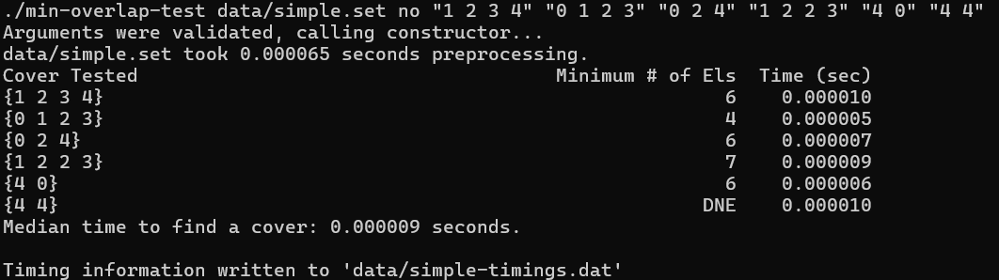

[Back to Portfolio](./)

Minimum Overlap
===============

-   **Class:** CSCI 315
-   **Grade:** B
-   **Language(s):** C++
-   **Source Code Repository:** [BCoder3/Brayden-K-csci-portfolio](https://github.com/BCoder3/source-code-repo-for-portfolio)  
    (Please [email me](mailto:BMKirkland@csustudent.net?subject=GitHub%20Access) to request access.)

## Project description

The Minimum Overlap Program is designed to take input as a text file containing mulitple groups of numbers, called sets. The program then finds the minimum overlap of how many sets must be chosen so that every number in the file is chosen at least once. The program also generates timing data to display the time taken to calculate the minimum overlap for any given set.

## How to compile and run the program

A makefile is included in the implementation of this project, which only requires the command "make" to compile the program. To run, use the command "make run", which also compiles the program again before running, if necessary. Other variations of make are included in the program's files, which are given sets for testing purposes, such as "make large30".

```bash
make
make run
```

## UI Design

The program's UI is limited to command-line interface, with little user interactivity. The program's main function is to iterate through specifically formatted, given text files of sets of numbers.

  
Fig 1. The launch screen

## 3. Additional Considerations

The program is not inherently designed to accept user input, but can be adjusted to do so. Additionally, gnuplot must be installed on the operating machine to generate timing data.

For more details see [GitHub Flavored Markdown](https://guides.github.com/features/mastering-markdown/).

[Back to Portfolio](./)
