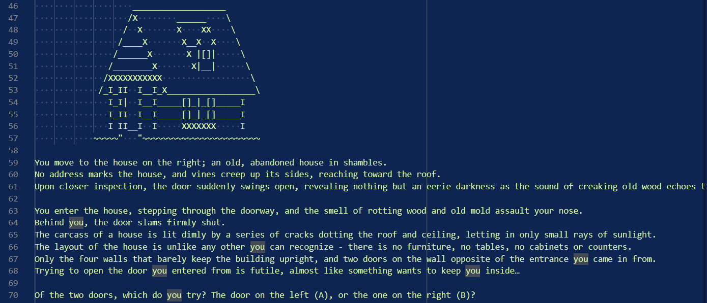

[Back to Portfolio](./)

Choose Your Own Adventure
===============

-   **Class:** CSCI 325
-   **Grade:** A
-   **Language(s):** Java
-   **Source Code Repository:** [BCoder3/project-4-source-code](https://github.com/BCoder3/project-4-source-code/tree/master)  
    (Please [email me](mailto:BMKirkland@csustudent.net?subject=GitHub%20Access) to request access.)

## Project description

The project photos and code in the source code repository are only a portion of the work done for this team project. Together, we wrote the code for this program to create a game that a user could play to experience a narrative of our own conception, and each of us wrote our own story. Included here is my portion of our work on the user-choice-driven narrative adventure, utilizing ASCII art.

## How to compile and run the program

In order to compile and run this program, Java must be installed on the machine intended to run it. To run from a Windows command line, ensure that the active directory in the prompt contains the Story.java file. Next, use the following commands:

```bash
javac Story.java
java Story
```

Throughout the running of the program, the narrative text will ask the user to occasionally choose "path A" or "path B". All the user need do is enter either letter "A" or "B", upper or lowercase, and enter, to continue down their chosen path of adventure.

## UI Design

Most of the user interface is made up of narrative text on a command line interface, and ASCII art, which are art pieces created using text characters.

  
Fig 1. An example of ASCII art, text, and user interactivity found throughout the program.

## 3. Additional Considerations

All ASCII art used for this project are not our original works, and were gathered on a free-source, ASCII art website. The program here can also be combined with other narrative stories that use the same format.

For more details see [GitHub Flavored Markdown](https://guides.github.com/features/mastering-markdown/).

[Back to Portfolio](./)
